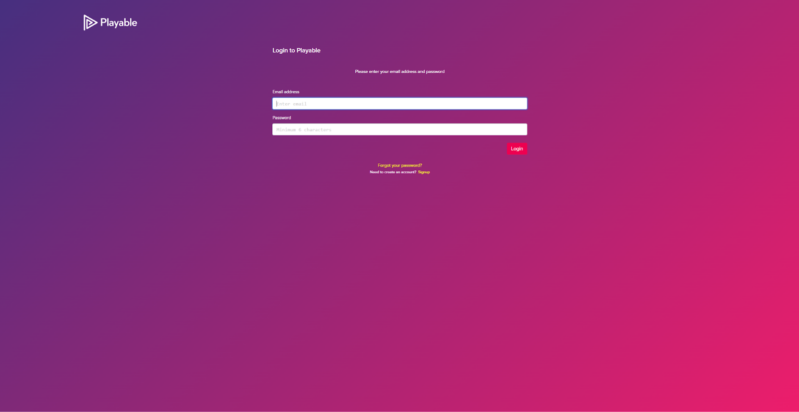

# Video Batch Upload Function

## Introduction

This technical tip introduces the new "video batch upload" (VBU) feature for the Playable
platform. VBU allows users with a valid access to the Playable console to select multiple video
source files and queue all the selected files for the upload and compilation and optimisation
processing. Once submitted the video files are sequentially processed and users are notified
when each is completed.

VBU dramatically improves user productivity in cases where multiple videos must be uploaded
and configured to play to a user, cohort of users based on profile data or other endpoint specific
data available at time of play.

## Feature Benefits

The batch video upload capability now available streamlines video uploads by eliminating
repetitive user tasks and file handling time. The new capability delivers a more efficient process
and provides visual progress tracking for easy monitoring. It is easy to use and increases
productivity of users significantly.

## How to Access Product Support

Thank you for enrolling in the customer beta test program for this new feature. We value your
input and feedback greatly. This is your opportunity to accelerate product quality and usability. In
this beta release there are several known issues which are documented in this Tech Tip.
However, other unknown issues may surface during this testing phase. It is important to report
any problems, suggested improvements, issues, errors with as much supporting content such as
screen grabs, recordings, use case description. Please email your input and findings to Anthony
Mansour at email: [Anthony Mansour (anthony.mansour@playable.video)](mailto:anthony.mansour@playable.video)

## Prerequisites

1. A valid Playable account, valid username and password is required.
2. Multiple video source files located on a network or local files system to which you have a
   minimum of read access privileges.

## Usage Steps

**Step 1.** To access the batch video upload feature, locate the url in the email you received with the
link to this TechTip. Copy the BVU link and use it to create a bookmark in your preferred browser.
You will use this bookmark to trigger all bulk uploads during the beta testing.

**Step 2.** Using the same browser navigate to Playable and login to your account.

**Step 3.** Once logged in to Playable, use the BVU bookmark to start the upload process.

**Step 4.** After entering the provided link you should be redirected to the page shown below.

**Step 5.** Click the plus sign located on the right side of the page to open the File Explorer or File
Finder depending on the device you are using.

**Step 6.** Select the video assets you want to upload. Once you have selected your set of files,
click the open button (within your file explorer) to confirm the upload. Note that instead of using
the file explorer you can drag drop your videos files onto the plus sign within the ping drop zone.

**Step 7.** After you submit the files for upload a confirmation prompt will request confirmation after
which a loading bar for each video will show progress. See the example below.

**Step 8.** Once loaded you will be automatically redirected to the “Summary” page of your first
video upload.

**Step 9.** To view all videos that were in the batch upload navigate to the “Videos” button on the
left hand side navigation bar. It will look something like this:

**Step 10.** Once an individual file or the complete batch upload is complete, videos can then be
edited. Some videos may still be in the processing state as they will not complete the processing
step at the same time. It is a good idea to check before opening.

## Demonstration Video

For a detailed demonstration video of how to complete the steps above, click here.
Here is the full URL for copy paste if you prefer:
https://drive.google.com/file/d/1cQv-5sgah6VHvIxpbJJKG0dKHZ0EYpFe/view?usp=sharing

## Actions to Avoid

Make sure to upload all the required videos at once, if you attempt to upload each video
separately the console could redirect you before you are able to find and upload that second
video.

## Known Issues and Bugs

### Confirmation Banner Issue

If you are planning to upload many videos (8+), note the confirmation banner at the top may take
up some screen space, as it provides a confirmation notification for each video. Whilst we are
working to improve this experience, you should close each confirmation by manually clicking the
x button on the right side of the notification messages.

### Correct Link To Start

Before each batch upload ensure you use the link defined in Step 1 which directs you to the
batch upload feature. You must use this link every time you want to perform a batch upload.

### White Screen Displayed

Occasionally when initially opening the link (which link, the one described in step 2) in your
browser it may leave you on a white screen window. If you encounter this, simply perform a
browser refresh.

These issues will be corrected in the GA release.

## Additional Notes

**File Format:** Ensure that the videos are in the specified format (preferably .mp4) for a seamless
batch upload experience.

**Network Stability:** A stable internet connection is recommended for uninterrupted batch uploads.

**Video Limit:** There might be a limit to the number of videos or total file size that can be uploaded
in one batch, please notify Playable if you encounter this limitation.

**Post-Upload Checks:** It's good practice to quickly skim through the uploaded videos after the
process is complete to ensure there were no corruptions during the upload and processing.

## Conclusion
The Playable console's batch upload feature simplifies and accelerates the video management
process. By adhering to the outlined steps, users can effectively enhance their upload routine.